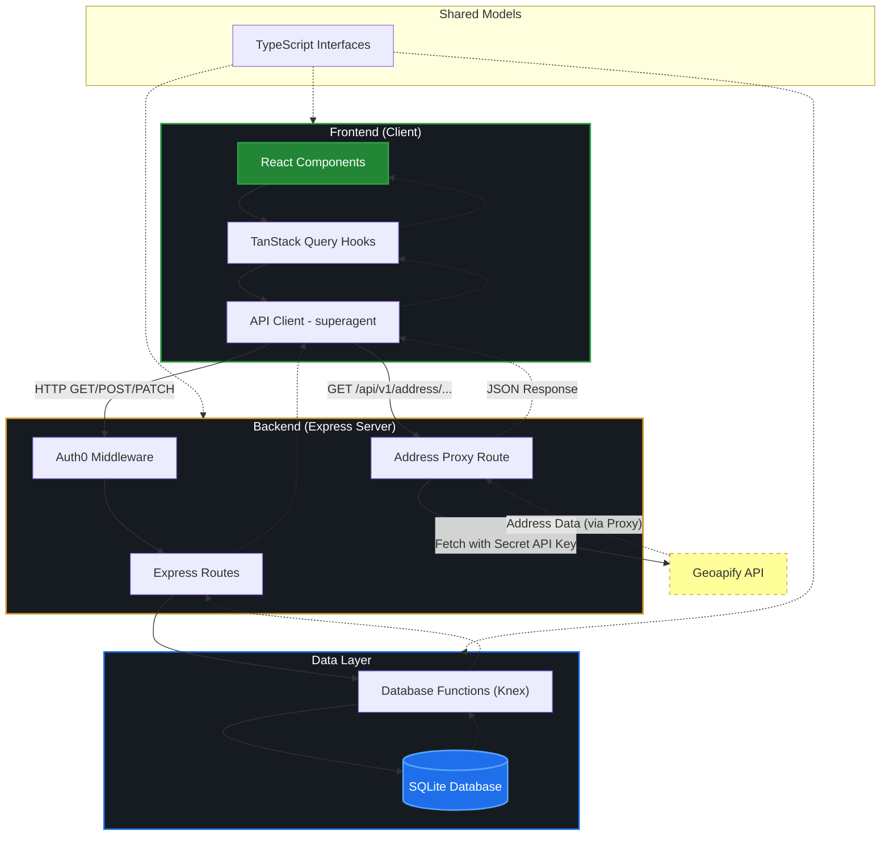
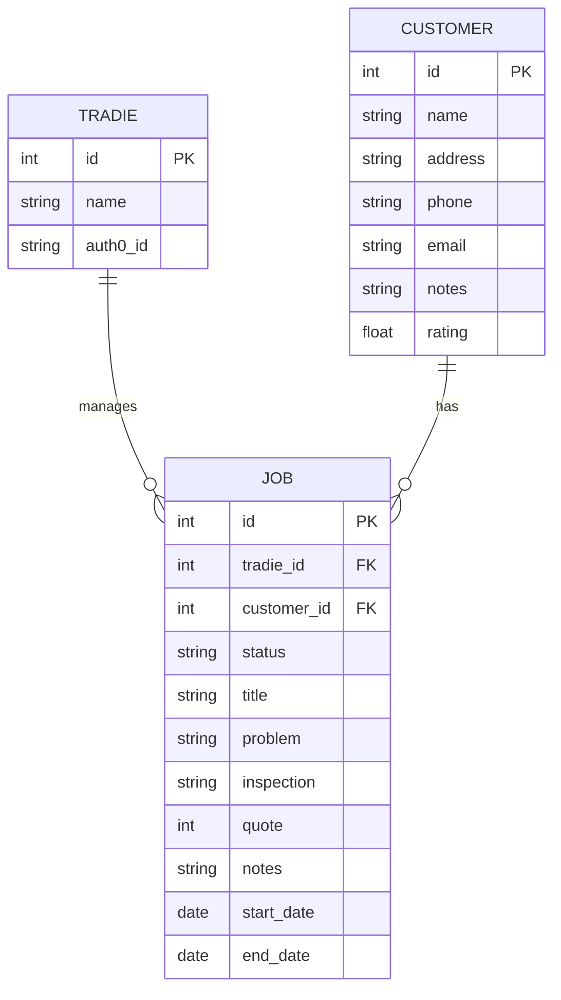

# WorkStack

A CRM and job management tool built for tradespeople — tracking 
customers, jobs, and costs in one place.

Built as a group project during Dev Academy Aotearoa's Raumati 2026 intake full-stack bootcamp.

## My contributions 
included designing the UI header and overall styling with Tailwind 
CSS, building the animated SVG logo, accessibility work (tested and 
refined using WAVE), writing tests, and a significant amount of code 
cleanup and refactoring, including browser re-sizing from desktop to mobile. I was responsible for close to half the 
commits across the project.

**Stack:** React · TypeScript · Node.js · Express · Knex.js · SQLite · Auth0 · TanStack Query · Vitest

## Running locally

git clone https://github.com/croft-tim/workstack.git
cd workstack
npm install
cp .env.example .env   # add your Auth0 and Geoapify keys
npm run dev

**WorkStack** is a specialized CRM and job management tool built specifically for tradespeople, combining customer relationship management with job tracking and scheduling in a single, integrated workflow. Built with React (frontend), Express (backend), SQLite (database), and TypeScript (shared models), the platform is evolving to include comprehensive financial tracking — enabling users to monitor customer-specific costs and revenue, manage total cost structures, and analyze overall business profitability.

## Logic Overview: Frontend to Backend

Architecture and data flow overview, from the React frontend to the SQLite database.



## 1. Architectural Layers

The application is structured into clearly defined layers:

- **Frontend (UI)**: React components in `client/components/`.
- **Data Fetching Hooks**: Custom React hooks in `client/hooks/` using TanStack Query.
- **API Client**: `client/apis/apiClient.ts` which uses `superagent` to make HTTP requests.
- **Backend API**: Express.js routes in `server/routes/`.
- **Database Layer**: Database access functions in `server/db/` using Knex.js.
- **Database**: SQLite3 database.
- **Shared Models**: TypeScript interfaces in `models/` used by both frontend and backend.

---

## 2. Data Flow Example: Fetching Jobs

Here is how data flows through the system when a user views the Job list:

### Step 1: Component Initialization

A React component (e.g., `KanbanBoard.tsx`) calls the `useJobs()` hook.

### Step 2: TanStack Query Hook

The `useJobs()` hook (in `client/hooks/useJobs.ts`) initializes a query with a unique key `['jobs']`. It specifies `getJobs` as the query function.

```typescript
export function useJobs() {
  return useQuery({
    queryKey: ['jobs'],
    queryFn: getJobs,
  })
}
```

### Step 3: API Client Call

The `getJobs` function (in `client/apis/apiClient.ts`) uses `superagent` to send a `GET` request to `/api/v1/jobs`.

```typescript
export async function getJobs() {
  const response = await request.get(`${rootURL}/jobs`)
  return response.body as Job[]
}
```

### Step 4: Express Route Handler

The backend (in `server/routes/jobs.ts`) receives the request. It calls a database function to retrieve the data.

```typescript
router.get('/', async (req, res) => {
  try {
    const jobs = await db.getAllJobs()
    res.json(jobs)
  } catch (error) {
    res.status(500).json({ message: 'Something went wrong' })
  }
})
```

### Step 5: Database Query

The database function (in `server/db/jobs.ts`) uses Knex to query the SQLite database.

```typescript
export async function getAllJobs(db = connection): Promise<Job[]> {
  return db('jobs').select()
}
```

### Step 6: Response Cycle

1. The database returns the data to the route handler.
2. The route handler sends the data as a JSON response.
3. The API client receives the response and returns the parsed body.
4. TanStack Query updates the hook's state with the data, causing the React component to re-render.

---

## 3. Mutations (Adding/Updating Data)

For actions like adding a new customer or updating a job, the flow is similar but uses `useMutation`:

1. **Component**: Calls a mutation hook (e.g., `useAddJob()`).
2. **Hook**: Uses `useMutation` to call an API function and provides an `onSuccess` callback to invalidate relevant queries (triggering a refresh).
3. **API Client**: Sends a `POST`, `PATCH`, or `DELETE` request.
4. **Backend Route**: Validates input and calls the database function.
5. **Database**: Updates the records and returns the result.

---

## 4. Authentication (Auth0)

Authentication is integrated into the flow:

- The frontend uses the Auth0 SDK to get an access token.
- The API client includes this token in the `Authorization` header (`Bearer <token>`).
- Backend routes can use the `checkJwt` middleware (if enabled) to verify the token before processing the request.

---

## 5. External API Integration (Address AutoComplete)

The application includes an address autocomplete feature that demonstrates a proxy-like pattern:

1. **Frontend**: Calls the backend route `/api/v1/address/autocomplete?text=...`.
2. **Backend**: The `server/routes/addressAutoComplete.ts` route receives the request and appends a private API key (`GEOAPIFY_API`) from the environment variables.
3. **External Fetch**: The backend makes a request to `api.geoapify.com`.
4. **Proxying**: The backend receives the response from Geoapify and sends it back to the frontend. This keeps the API key secret and avoids CORS issues.

---

## 6. Database Schema (ERD)

The following diagram illustrates the core entities and their relationships within the WorkStack database.



---

## 7. Type Safety

Type safety is maintained across the stack by using shared models defined in the `models/` directory.
This shared type system helps catch errors early and ensures that both sides of the application are aligned in terms of data structures.

- **Frontend**: API functions and hooks use these types to ensure data matches the expected structure.
- **Backend**: Database functions and route handlers use the same types to ensure consistency between the database schema and the API response.
